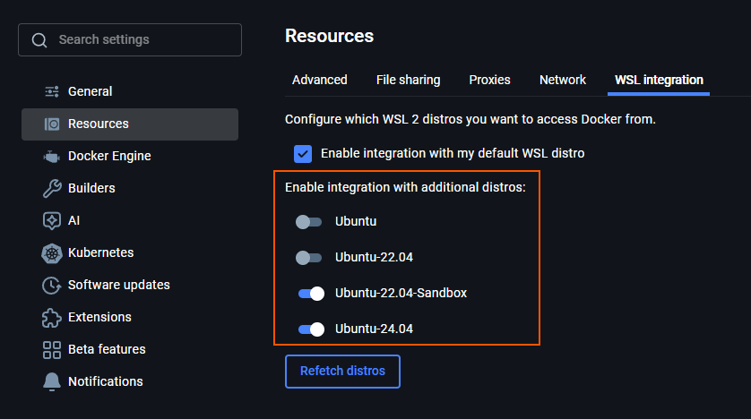
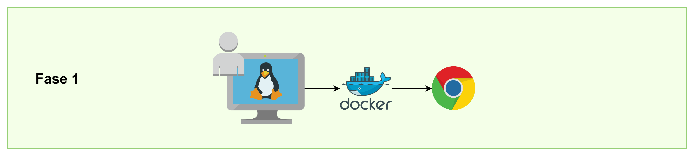
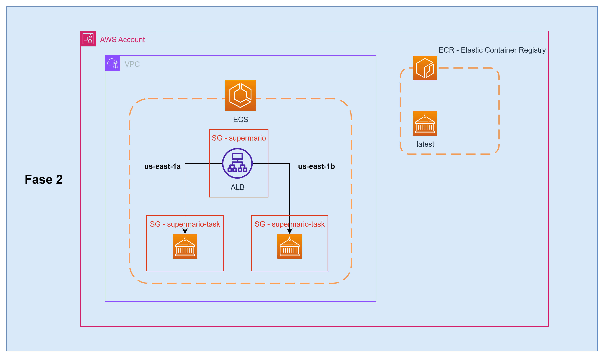
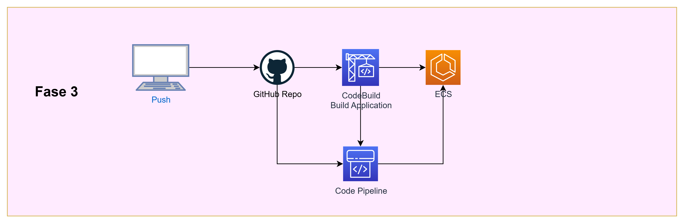

# 2 AI - XP Edu - Docker Super Mario
Infinite Mario in HTML5 JavaScript

## Premissas:
- Docker instalado. Utilizo o Docker Desktop para Windows com integração com o WSL2. Nas configurações do Docker Desktop você vai encontrar onde habilita a integração com a sua distribuição do WSL.

- Terminal Linux. É possível executar no windows também, mas a aula será realizada em Linux;

- AWS CLI v2. Precisaremos do AWS CLI para executar alguns comandos, principalmente durante as fases 1 e 2;

- Uma conta na AWS para criamos a nossa infraestrutura e o pipeline de CI/CD;

- Um repositório de código no Github que será posteriormente a origem do nosso pipeline;

## Etapas
Nessa aula vamos usar essa aplicação de base para criamos o nosso ambiente na AWS passando pelas 3 fases abaixo:

1. Testes Locais

2. Construção do ambiente na AWS com Deploy Manual

3. Deploy 100% automatizado com GitHub + CodePipeline integrados

### Bora para a prática!